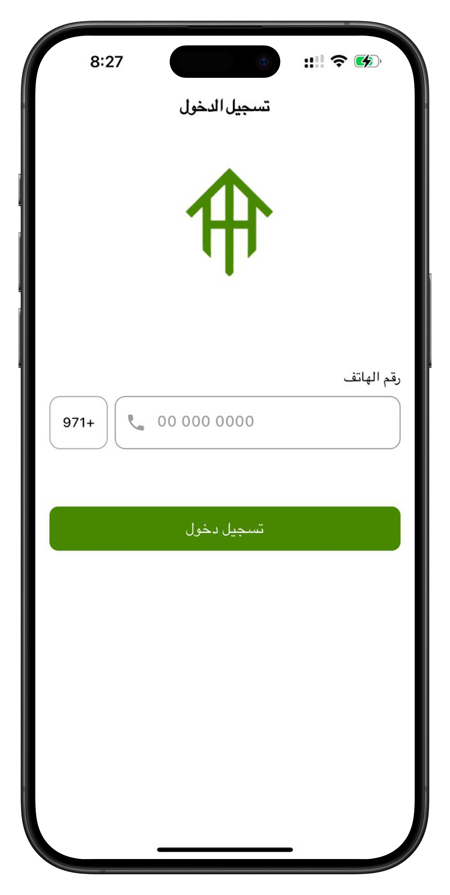
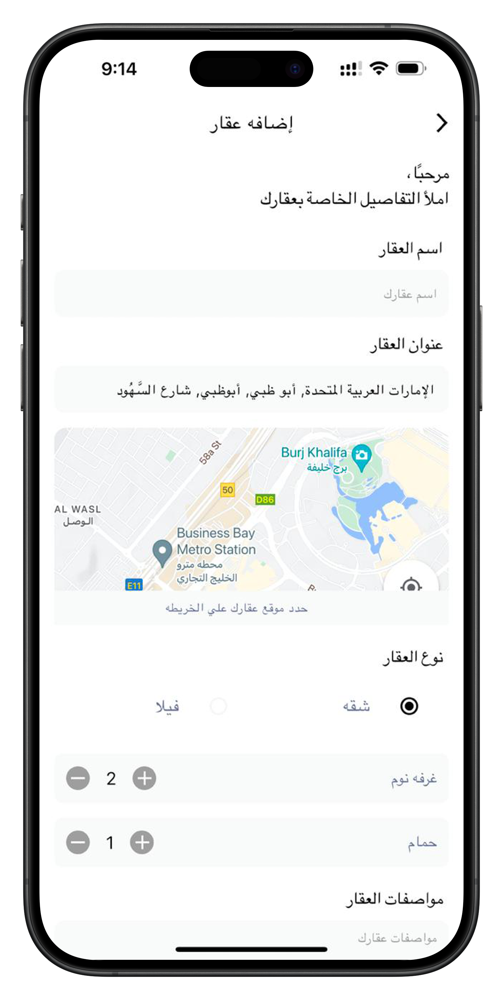
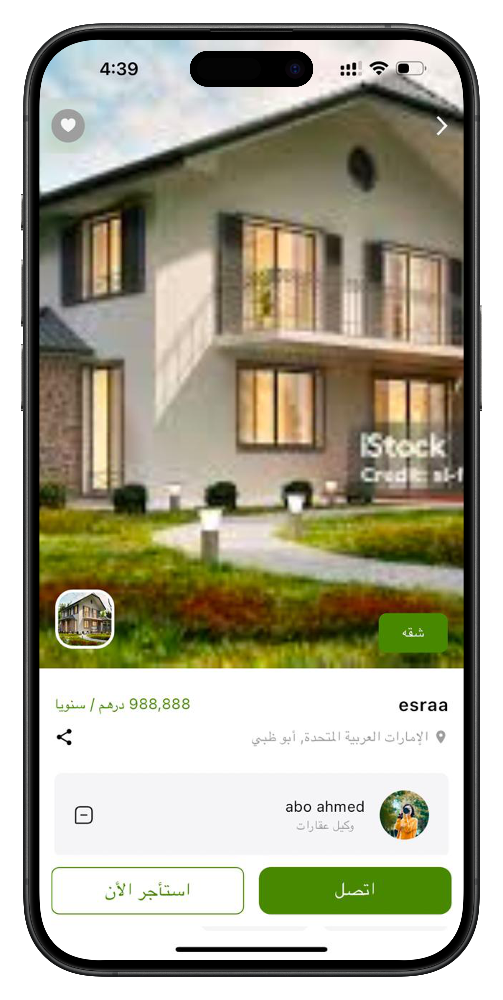
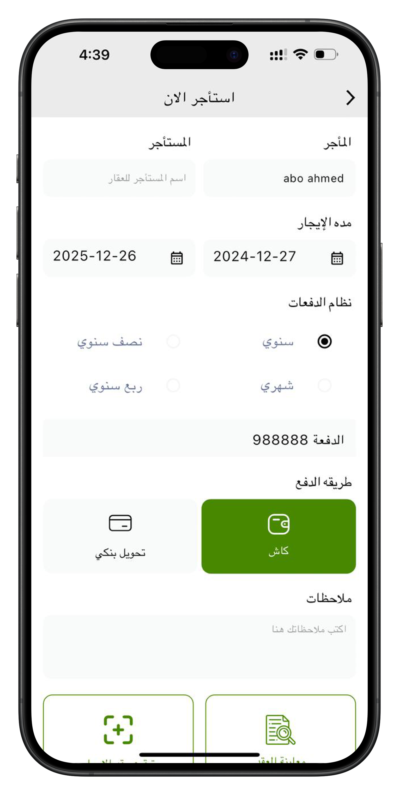
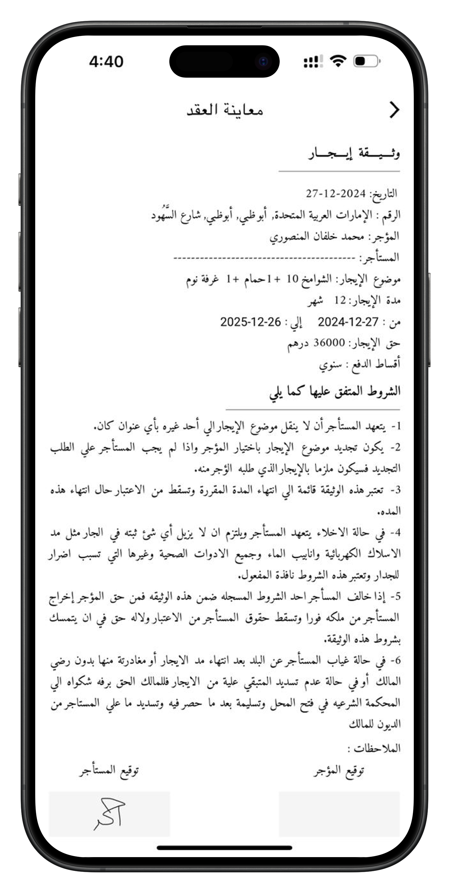
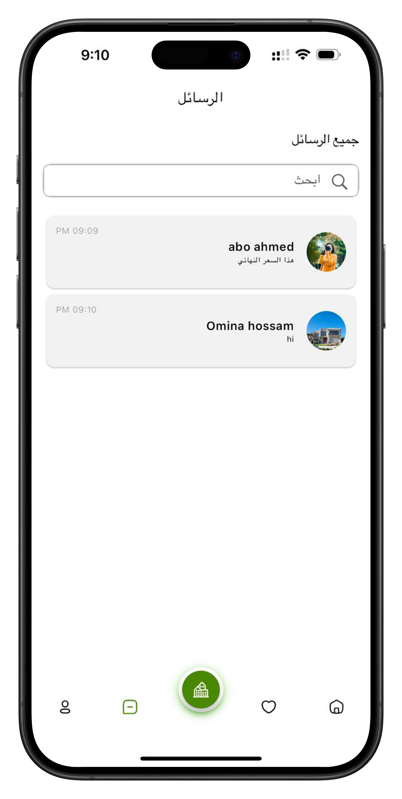
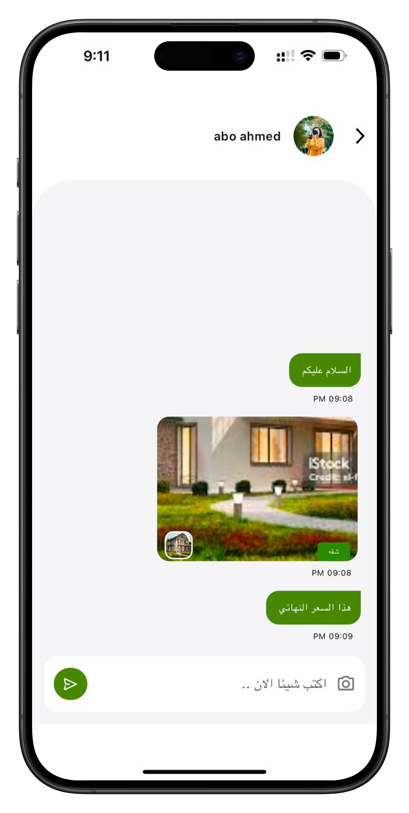
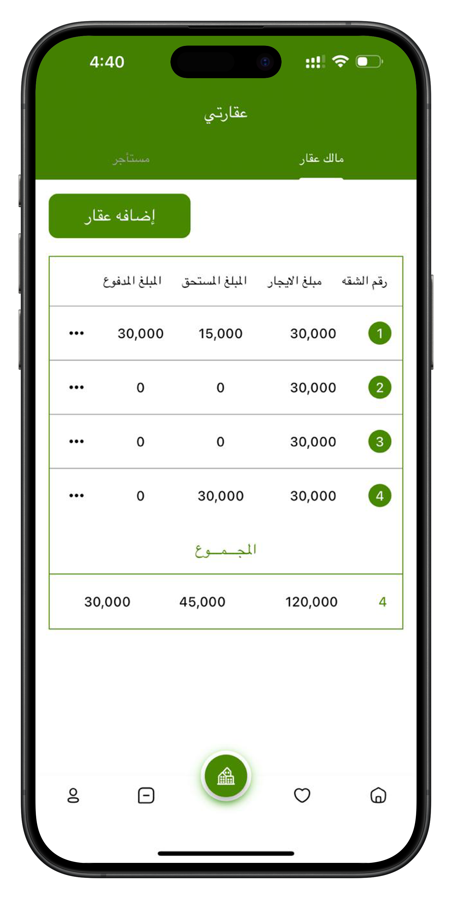
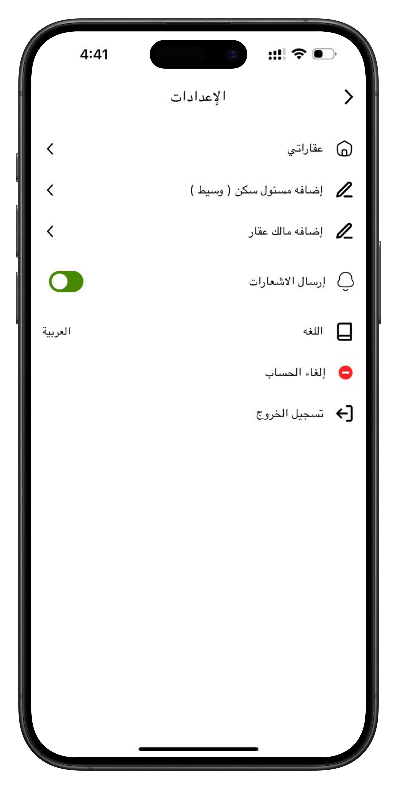

# Project Name: Aqary

## Description
A real estate mobile application for browsing, listing, and managing properties. Users can explore available properties, view detailed information, and contact property owners seamlessly. Built with Flutter and Riverpod for efficient state management and scalable architecture.

## Features
- Property browsing and detailed information
- User authentication (login and registration)
- Property listing and management for owners
- Contact feature to reach property owners
- Real-time property availability updates

## Technologies Used
- Flutter, Dart, Riverpod, REST API, Firebase, Provider, Local Storage

## Screenshots

    
    
    

    
    
    

    
    
    

       

