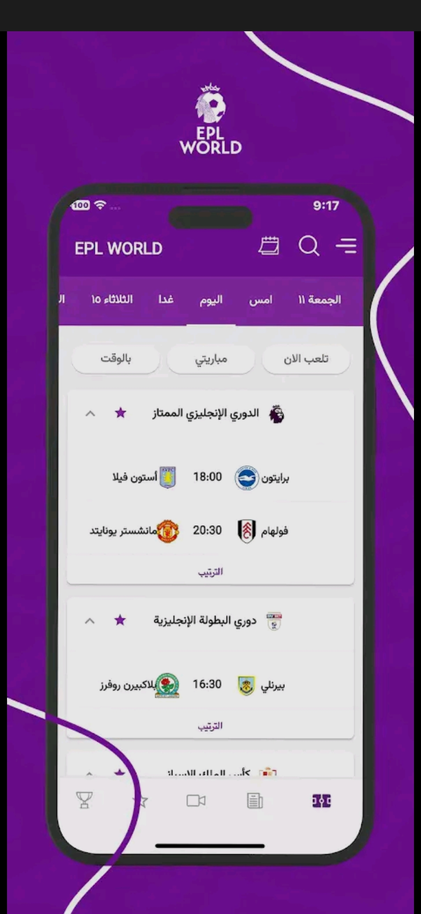
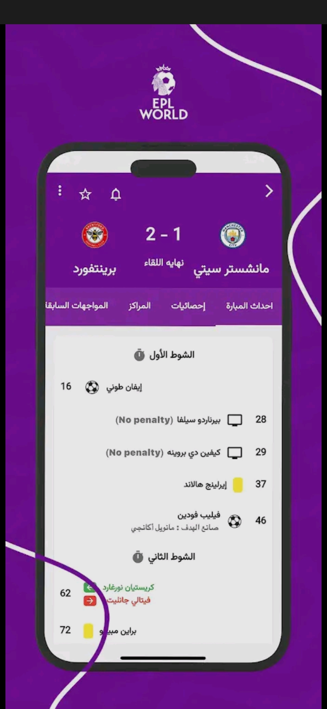
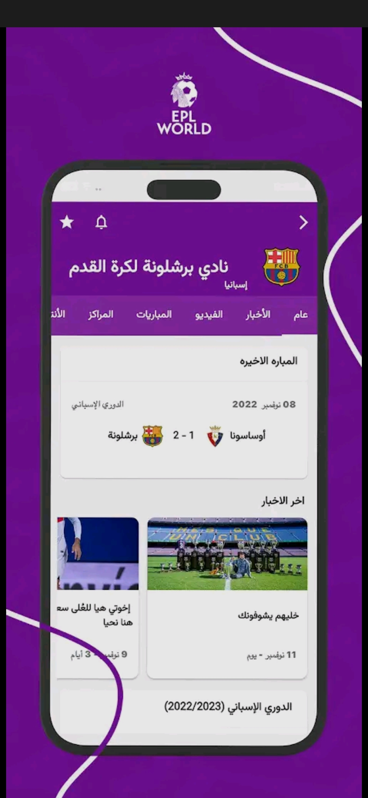
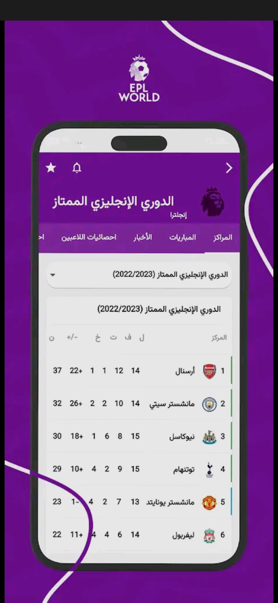
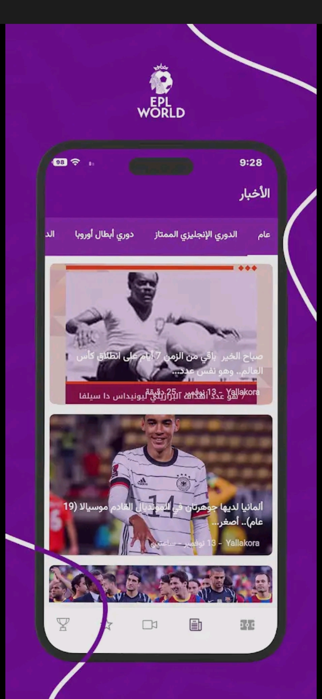
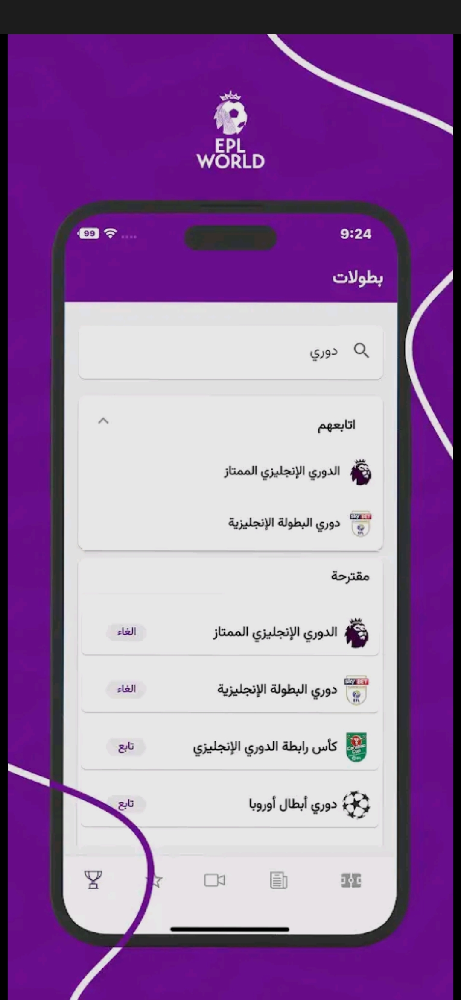

# Project Name: EPL World

## Description
A comprehensive football application that provides live match updates, 
team and player statistics, match schedules, and league standings from various football leagues worldwide. 
Built with Flutter, Riverpod, and clean architecture to deliver a seamless and scalable user experience.

## Features
- Live match updates and real-time scores for multiple leagues
- Team and player statistics across various competitions
- Match schedules and reminders
- League standings and rankings
- User-friendly navigation and personalized notifications

## Technologies Used
- Flutter, Dart, Riverpod, REST API, OnSignal, Hive

## Screenshots

### Home Screen and Match Details

    
    

  

### Team  and League 

    
    

  

### News  and Leagues

    
    

  
