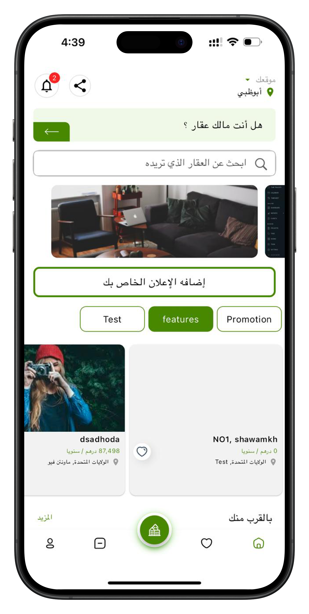

# My Portfolio

Hi, I'm Mahmoud Gaber, a passionate mobile app developer specializing in Flutter, Swift, and clean architecture. Below are some of my key projects:

## Projects

  

    <h3><a href="https://github.com/MahmoudAGaber/portfolio/tree/main/Aqary">Aqary (Real Estate App)</a></h3>
    
A real estate app with features for browsing, listing, and managing properties. It allows users to view property details, contact owners, and track listings.

    
  

  

    <h3><a href="https://github.com/MahmoudAGaber/portfolio/tree/main/Yocar">Yocar</a></h3>
    
A mobile application for booking rides, managing user profiles, and real-time tracking for both riders and drivers.

    
  

