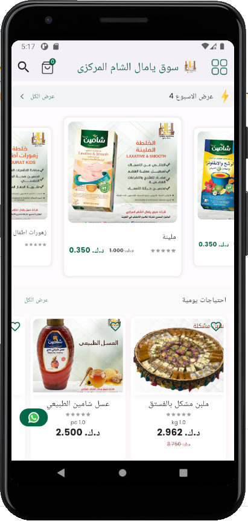
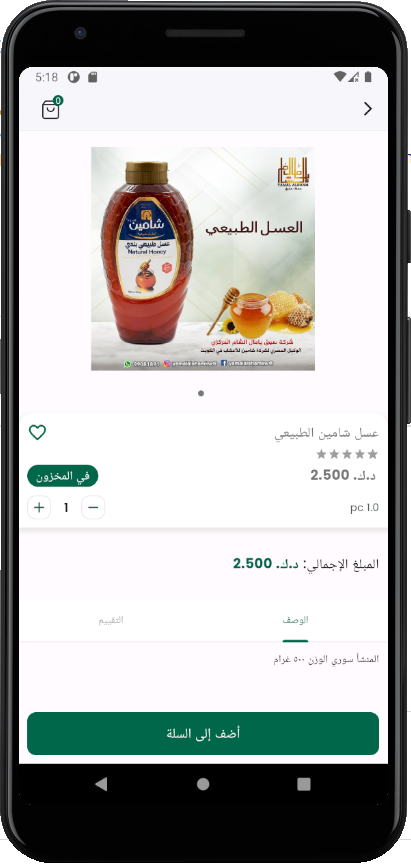
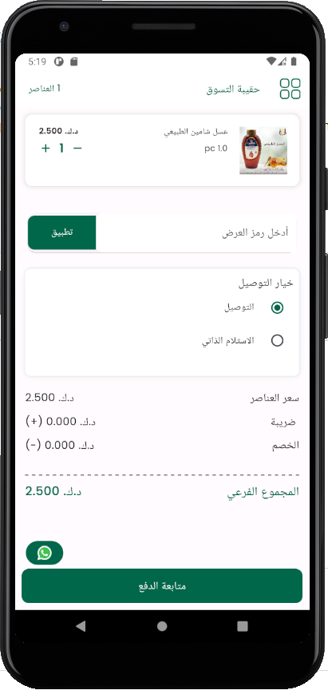
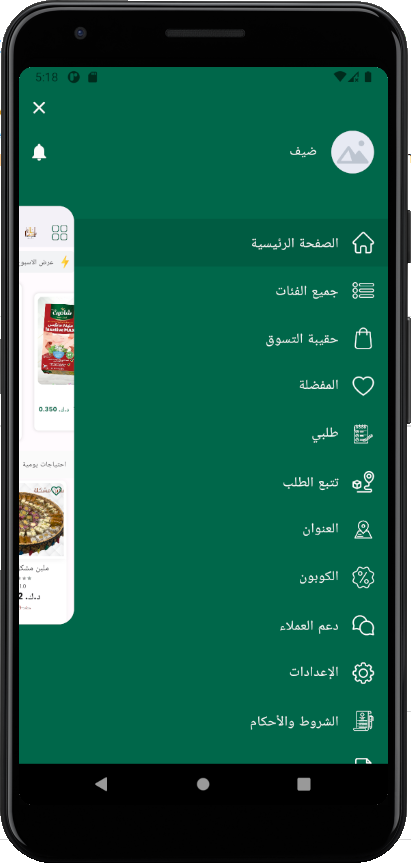

# Project Name: Yamal Al Sham

## Description
A comprehensive grocery mobile application designed for seamless product browsing, 
cart management, and real-time order tracking. 
Developed from scratch using Flutter and Provider to ensure high performance and scalability. 
The app provides a user-friendly shopping experience across iOS and Android platforms.

## Features
- Product browsing with detailed descriptions and categories
- Cart management with real-time updates
- Real-time order tracking
- User authentication (login and registration)
- API integration for product and order management

## Technologies Used
- Flutter, Dart, Provider, REST API, Firebase

## Screenshots

    
    
    

  

    
    

  
