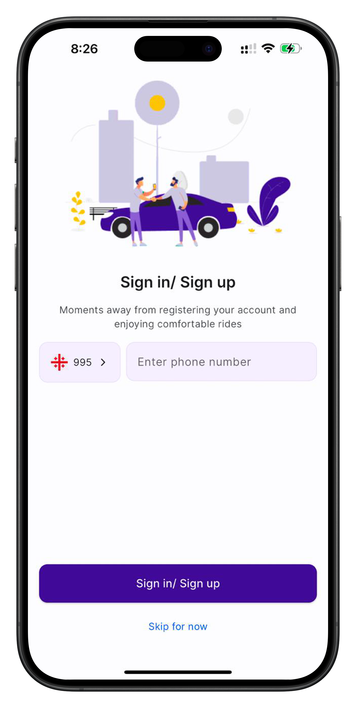
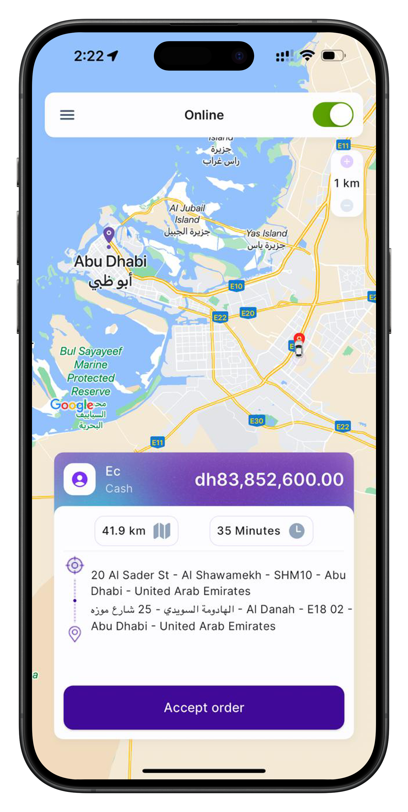
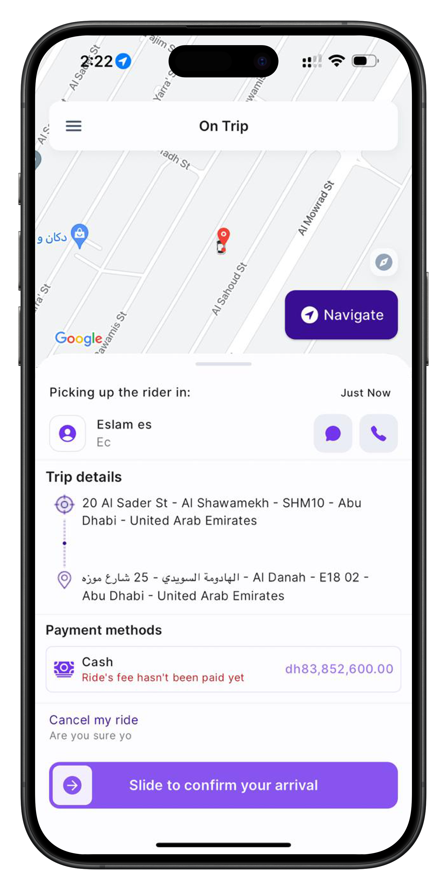

# Project Name: Yocar

## Description
A mobile application for booking rides, managing user profiles, and real-time tracking for both riders and drivers. The app provides an intuitive interface for users to book rides, track drivers, and make payments seamlessly.

## Features
- User authentication (login and registration)
- Real-time ride tracking with MapKit integration
- Profile management for riders and drivers
- Secure payment integration
- Driver and rider-specific views

## Technologies Used
- Swift, UIKit, REST API, MapKit, UserDefaults

## Screenshots

### Rider Side Screens

    
    
    

### Driver Side Screens

    
    
    

### Additional Screens

    

## How to Run
1. Clone the repository to your local machine.
2. Open the project in Xcode.
3. Run the app on a physical device or simulator.

## Installation
1. Ensure you have the latest version of Xcode installed.
2. Install necessary dependencies using CocoaPods or Swift Package Manager.
3. Build and run the app.

## License
This project is licensed under the MIT License - see the [LICENSE](LICENSE) file for details.
