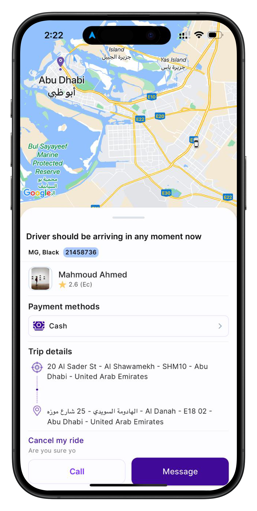

# Project Name: Yocar

## Description
A mobile application for booking rides, managing user profiles, and real-time tracking for both riders and drivers. The app offers an intuitive interface for users to book rides, track drivers, and make payments seamlessly, built with Flutter using BLoC state management and Clean Architecture for scalability and maintainability.

## Features
- User authentication (login and registration)
- Real-time ride tracking with GoogleMap integration
- Profile management for riders and drivers
- Secure payment integration
- Driver and rider-specific views

## Technologies Used
- Flutter, Dart, BLoC state management, Clean Architecture, REST API, GoogleMap,

## Screenshots

### Rider Side Screens

    
    
    

### Driver Side Screens

    
    
    

### Additional Screens

    

