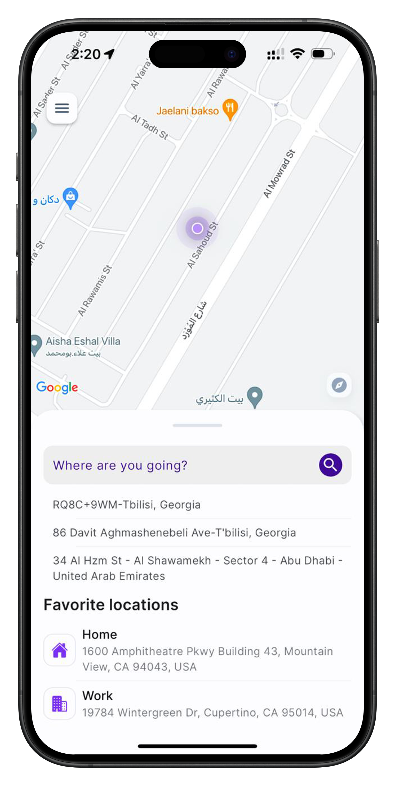

# Project Name: Food Delivery App

## Description
A mobile application for ordering and delivering food from local restaurants. Users can browse menus, place orders, and track delivery in real-time.

## Features
- User authentication
- Real-time tracking using MapKit
- Secure payments with Apple Pay integration

## Technologies Used
- Swift, UIKit, REST API, MapKit

## Screenshots

